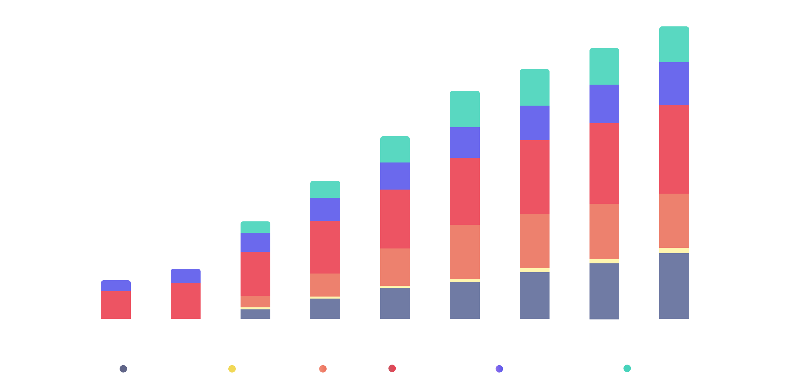
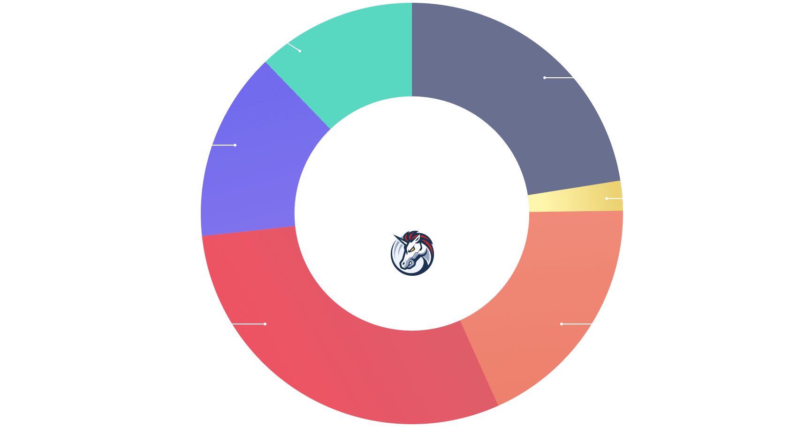

# 1INCH Token

### What is 1INCH?

1INCH is the ERC-20 governance and utility token of 1inch Network. It was launched with the primary purpose of facilitating governance rights to participants of the [1inch DAO](https://docs.1inch.io/docs/governance/overview). Its current utility now also includes staking and delegating to 1inch Resolvers, who are designated to fill [1inch Fusion swaps](https://docs.1inch.io/docs/fusion-swap/introduction).

### Launch Details

The token was [officially launched](https://blog.1inch.io/1inch-token-is-released/) on December 25, 2020. 

### Token Contract

- [Ethereum Mainnet: 0x111111111117dc0aa78b770fa6a738034120c302](https://etherscan.io/token/0x111111111117dc0aa78b770fa6a738034120c302)
- [Binance Chain: 0x111111111117dC0aa78b770fA6A738034120C302](https://bscscan.com/address/0x111111111117dC0aa78b770fA6A738034120C302)

### Supply Details

- Total Supply: 1,500,000,000
- Circulating Supply: 817,236,767

### Token Unlock Schedule

On the release day, 6% of the 1INCH token's total issuance of 1.5 billion was unlocked. The remaining tokens will be gradually unlocked over a [four-year period](https://1inch.io/token/) by the end of 2024.

 

### Token Distribution

- 30% of the total token supply will go to community incentive programs. 
- 14.5% form the growth and development fund that will be used to issue grants and incentivize developers to build on 1inch protocols. 
- The remaining tokens will go to backers and core contributors.

### Token Utility 

The 1INCH token is used in different capacities in the existing protocols and will be used in the tokenomics of all new protocols released by the 1inch Network. It is a multi-chain token, currently available on Ethereum and on BNB Chain over a bridge.

### Governance

The 1INCH token is used to govern all of the 1inch Network's current and future protocols. It is utilized in the governance modules of the 1inch Aggregation Protocol.

### Multi-chain

The 1INCH token is currently available on Ethereum and BNB Chain. The BSC integration was implemented over a bridge, with no extra token issuance.
