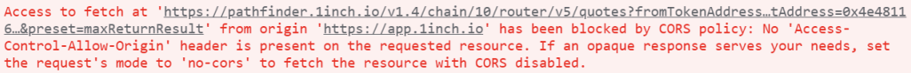

When integrating the 1inch API in your dApp, you might experience an issue with CORS (Cross-Origin Resource Sharing). It can be confusing, especially when your API calls are successful via tools like [Curl](https://curl.se/) or [Postman](https://www.postman.com/), but fail when made from your custom dApp's UI.

## This article covers:
- [What is CORS?](#what-is-cors)
- [Why am I facing this issue?](#why-am-i-facing-this-issue)
- [How can I resolve CORS errors when calling the 1inch API?](#how-can-i-resolve-cors-errors-when-calling-the-1inch-api)
- [Can I call functions without a server and still avoid CORS errors?](#can-i-call-functions-without-a-server-and-still-avoid-cors-errors)

### What is CORS?
Cross-Origin Resource Sharing (CORS) is a common security protocol implemented by most browsers to help prevent security risks with cross-origin requests. Essentially, a cross-origin request is when a web page from one domain tries to access resources, like data or images etc., from a different domain.

For example, say you're browsing "[coindesk.com](https://www.coindesk.com/%5C)" and it has a ETH/BTC ticker widget that pulls price data from "[tradingview.com](https://www.tradingview.com/)". When the "coindesk.com" domain tries to fetch the price data from the "tradingview.com" domain, it's making a cross-origin request.

Browsers prevent HTTP requests to a different domain than the one hosting the web page, in order to protect users against cross-site security threats. This can be really helpful in blocking things like [request forgery](https://owasp.org/www-community/attacks/csrf), malicious [script inclusion](https://owasp.org/www-project-web-security-testing-guide/v41/4-Web_Application_Security_Testing/11-Client_Side_Testing/13-Testing_for_Cross_Site_Script_Inclusion).

### Why am I facing this issue? 
When the CORS protocol blocks your requests, it's a signal that the 1inch API hasn't granted explicit permissions to your domain. For 1inch integrations, this usually happens when trying to call the 1inch API from you're dApp's front-end.

When sending a request through a frontend, the API key is embedded within the client-side code or headers, making it accessible to anyone who inspects the webpage's source or monitors its network traffic. This makes it so a malicious actor could easily extract and use your exposed key for their own benefit (or even to get around their own rate limits)!

### How can I resolve CORS errors when calling the 1inch API?
The most common solution is to run your request through some type of middleware or proxy server. This additional component makes the call, receives the response, adds necessary headers, and then forwards it to your application. Then the browser will see the request as originating from the same domain, avoiding any CORS triggers.

You can use your own custom proxy or a turnkey proxy server like [Lambda / AWS](https://docs.aws.amazon.com/apigateway/latest/developerguide/set-up-lambda-integrations.html).

Please note: Make sure that your API key and headers are entered correctly!

### Can I call functions without a server and still avoid CORS errors?
Since non-server functions are still called on the front-end, your request will still likely be blocked.

*Need higher rate limits? Request an enterprise endpoint [here](https://portal.1inch.dev/enterprise).*
