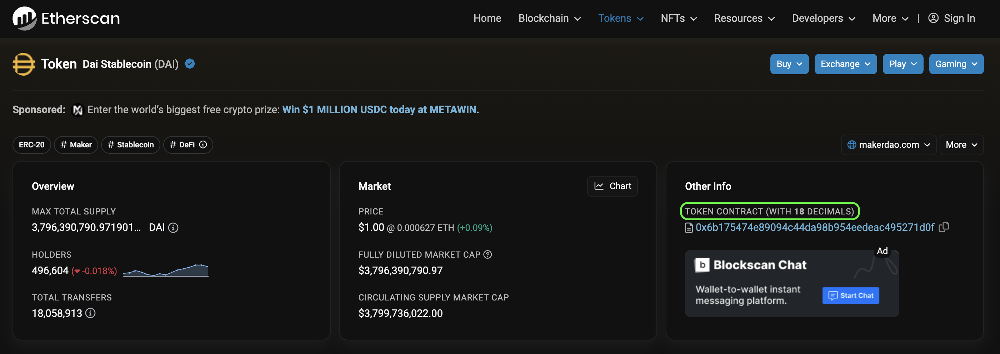

# Common API Error Messages Explained

If you're encountering issues with our API, this guide will help you understand some common error messages and their meanings.

## General Errors

- **400 - Bad Request:** This indicates an incorrect parameter. Ensure that all required parameters are correctly set.

- **429 - Rate Limit:** You've made too many requests to the API within a 1 second time period. Reduce your requests per second (RPS) to stay below the free 1rps limit. If higher limits are required, please fill out the 1inch Network Enterprise API application.

- **503 - Banned IP:** The IP address you're using to access the API is banned. Please ensure you're adhering to 1inch Network's terms of use.

- **The API isn't behaving as expected:** In certain cases you may be passing in a parameter supported by the API but the wrong type or expected value. For example `disableEstimate=true` will work but `disableEstimate=True` will not. All parameters are CAsE SenSiTive. This is especially apparent when stringifying boolean values in python. 

## Specific Errors

- **Cannot sync token:** The token either doesn't exist on the blockchain or isn't a valid token. Also, double check that you are using the correct chainID in relation to the token used.

- **Amount is not set:** The 'amount' field hasn't been specified. 
  - ***Please note:*** All token amounts must be in the correct decimal format! The decimal format can be found by looking up the token contract on the block explorer. 
  
  - **Example:** If the [source token is DAI](https://etherscan.io/token/0x6b175474e89094c44da98b954eedeac495271d0f), and you are sending 1 DAI, the amount with 18 decimals would be `1000000000000000000`.

      

- **Src is not set:** The 'src' (source token contract) field is missing.

- **Dst is not set:** The 'dst' (destination token contract) field is missing.

- **Insufficient liquidity:** The aggregator can't find a route for the swap due to low liquidity.

## Swap-specific Errors

- **400 - Bad Request:** This will be similar to the general 400 error; however, these error messages will also specify a missing parameter or more details of the problem.

- **Not enough src balance:** This means your source token balance is insufficient. It provides the required amount and your current balance.

- **Not enough Allowance:** You haven't granted the necessary token allowance to the 1inch router. It'll indicate the amount, current allowance, and the spender address, e.g., "Spender: 0x1111111254eeb25477b68fb85ed929f73a960582".

- **Insufficient liquidity:** As mentioned earlier, the aggregator couldn't route the swap.

> *** Please note:*** This list is not comprehensive. Other errors involving the dynamics of generic EVM transaction estimations might require deeper investigation.
