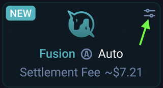

# Fusion FAQ

## Creating Orders / Swapping
### What is the difference between "Fusion" and "Legacy" modes?

**Fusion mode** - is the default mode for users. It doesn't require any gas fees for the user to execute a swap (outside of “fast” mode), as the "taker" aka resolver pays for all related transaction costs. Each order is filled within a specific price range starting from high to low (dutch auction), designed to incentivize resolvers to take orders. This revolutionizes the execution of swaps on decentralized exchanges. Fusion mode also provides native front-running protection, as the resolvers who fill order bundle transactions before sending them to the mempool. 

Within Fusion mode, there are 3 different options:

 

* **Fast** – With this option, the user is willing to accept a slightly less desirable rate in order to have their swap executed within the first few blocks.
* **Fair** – With the Fair option, the user agrees to a bit longer order execution time in exchange for a more desirable rate. The starting rate is slightly higher than the market price, and there is a chance that the rate might change during the transaction’s execution to become more favorable for the user.
* **Auction** – With the Auction option, the user agrees to wait for the maximum expiration time (10 min) in order to receive the most favorable rate for their trade. The starting rate is 1% better than the market, and this option is especially suitable for swapping large amounts of assets, taking advantage of arbitrage opportunities. 
* **Custom** – This feature is still under development

**Legacy mode** - This is the original 1inch Network aggregation protocol. With Legacy mode, users must pay gas fees for every swap, however they can execute the transaction almost immediately and at (or near) the quoted rate.

***Please note: The quoted rate might be lower with Legacy mode; however, after taking gas costs into account, Fusion swaps have a higher net returned amount potential.***

### Why did my swap expire or remain unfilled?
Each swap has a specific time window for a resolver to take trade. The longer the swap window, the higher chance there is of a resolver taking the order. If a resolver did not take your trade within the allotted time for your order, it will expire and you will have to resubmit it.

### What are the min and estimated amounts
The "estimated" amount is the expected return for your trade, based off of current market rates. The "min" amount is the estimated amount minus your allotted slippage tolerance.

### What do all of the different swap settings mean?
To access the swap settings in Fusion mode, click this little icon:  

 

You will then be able to see all of the Fusion mode settings:  

 

Starting from the top, here are descriptions of the swap settings:

* **"Max"**: This will enter maximum balance of the selected token in your wallet into the swap window.
* **Fusion/Legacy buttons**: Selecting either "Fusion" or "Legacy" will change the mode in which you are swapping. 
* **Settlement fee**: This is the estimated amount that the resolver will charge for filling the order (paid with the amount tokens returned)
* **"Auto, Fair, Fast" buttons**: These options determine the auction length and amount received parameters that your swap is completed with. 
* **Rate/receive**: This toggles the parameters view of the rate (price) to the estimated number of tokens returned. 
* **USDC/DAI (see example above)**: This toggles the rate (or returned amount) with the reverse rate (or returned amount)
* **"Max", "min", "auction time"**: 
* **Est. Receive**: This is the best return amount at current market rates. In some scenarios, the actual received amount may be higher
* **Est. Buy Price**: The estimated rate for the token purchased (open the dropdown to see the estimated token sell rate)
* **Min. Buy Price**: The lowest possible rate for the token purchased (open the dropdown to see the minimum token sell rate)

## Staking
### What are the benefits of holding st1INCH tokens? 
The rewards for staking 1INCH tokens comes from a few places:
* **Delegation** - Holding 1INCH tokens will give you Unicorn power. This power can be delegated to resolvers in order to receive token rewards from both resolver incentive programs (farms), and to 1inch Network DAO participants.
* **Receive Unicorn power** to be used for resolving, delegation, and governance.

***A note on APYs*** - When you select a resolver to delegate to, you will see a quoted APY next to each individual farm. This APY represents the average rewards that have been distributed throughout the life of each resolver's farming/incentive program. This APY is quoted in percentage terms, and is distributed in the form of tokens. Each resolver has a different APY, and therefore each of the resolver farms are competing for delegation power of stakers.

## Penalties
#### What is the penalty for unstaking my 1inch tokens before the term limit of 2 years?
The penalty for unstaking 1INCH tokens before the lock time is taken in the form of 1INCH tokens. This penalty decreases exponentially with time, and is inversely proportionate to the amount of Unicorn power that decreases during the staking period.

The lock period is between 1 month and 2 years. The longer the locking period the more “staking power” a resolver is granted at the beginning of the period.

 

Blue Line = Unicorn Power  
Orange Line = 1INCH tokens taken as penalty

For those who want to withdraw their stake, they must wait until the initial token penalty threshold has passed.

### What happened to the legacy stake reward program?
With the introduction of 1inch Fusion Mode, the legacy stake reward program was deprecated, and now only resolvers are eligible to receive rewards for gas fees paid to resolve/take 1inch Fusion swaps. Since the resolvers pay Fusion Mode gas fees, there would be nothing to refund back to users who create the swap.

## Delegating
For Delegating, there are two different pods: resolving and governance. A minimum of 100% of the Unicorn power that is acquired from staking 1inch can be delegated to either pod (but not both). The Unicorn power decay rate is then transferred to the delegate, and is kept separate from their pre-existing rate.

With resolving pods, delegators can choose which resolver to delegate to, based off of the reward structure they prefer.

### How does 1inch Fusion swap protect users from front running (MEV)?
Generally speaking, transactions can be front-run aka "Sandwich Attacked" between the time they are submitted to the mempool and the time that the block is added to the chain. (See this article for more info)

All 1inch Fusion swaps are matched directly with Resolvers (takers), and are subsequently placed into a bundle with other orders before being included in the block on-chain. Since a Fusion swap is combined with other transactions, this completely eliminates the risk of your swap being front-run.

## Resolving
### What are 1inch resolvers?
1inch Resolvers are top holders of st1INCH tokens, who are designated to fill the orders of 1inch Network swappers. Resolvers fall within the top 10 balances of Unicorn Power can be exclusively registered to fill orders.

***Only whitelisted resolvers have the chance of earning fees for filling users’ orders.

### What are the requirements for becoming a resolver?
To fill an order, a resolver must be whitelisted, have a sufficient balance to pay the order fee, and obtain enough Unicorn Power to be in the top 10 whitelist. Follow these steps to begin resolving:
* Gain enough unicorn power to be listed among the top 10 registered resolvers. There are two options available to grow your unicorn power:
  * Stake more 1inch or lock your stake for a longer period.
  * Attract more delegates through farming to delegate their unicorn power to you.
* Register as a resolver in the whitelist and delegation, and set up a worker address.
* Deposit 1inch into the FeeBank to cover resolving fees.
* Start resolving swaps.

Have further questions? Feel free to reach out to us in the live support chat!
